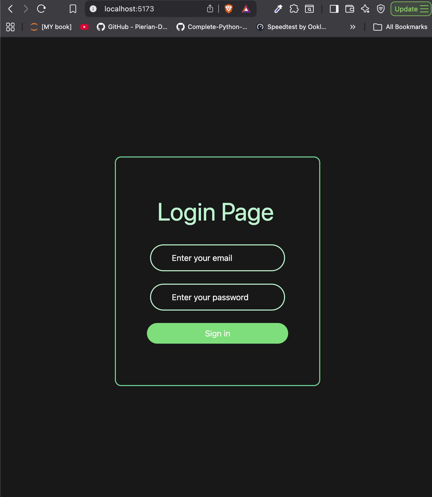
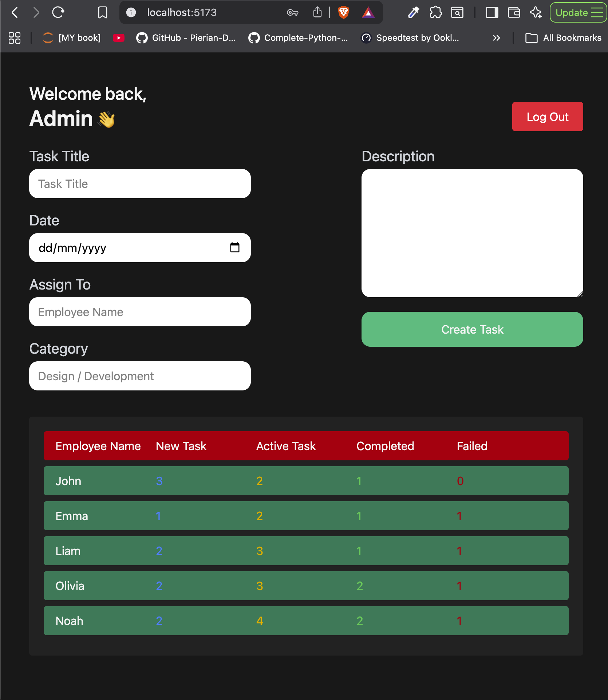
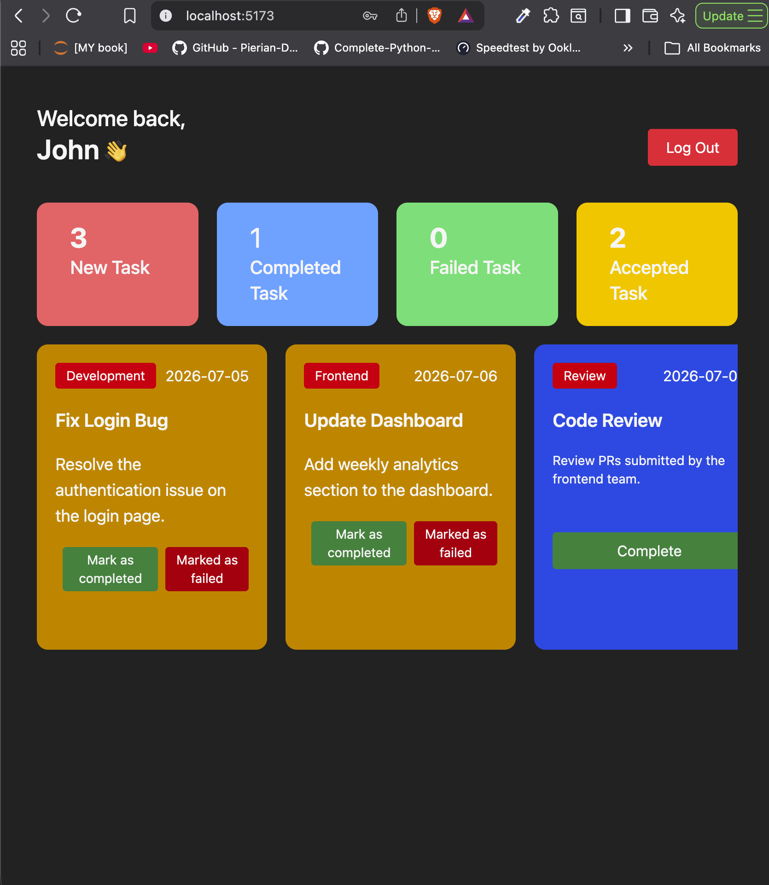
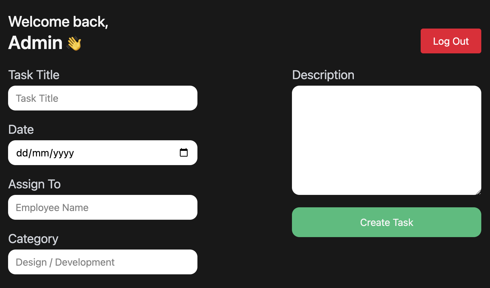

# 🚀 Employee Management System

A modern Employee Management System built using **React.js** that allows administrators to assign tasks and employees to manage, update, and track their work efficiently.

---

## ✨ Features

- 🔐 Admin Authentication
- 👨‍💼 Employee Authentication
- 📋 Task Assignment
- ✅ Task Status Management
- 📊 Dashboard Overview
- 💾 Local Storage Persistence
- ⚡ Fast React + Vite Application

---

# 📸 Screenshots

## Login Page

<p align="center">
  
</p>

---

## Admin Dashboard

<p align="center">
  
</p>

---

## Employee Dashboard

<p align="center">
  
</p>

---

## Create Task

<p align="center">
  
</p>

---

# 🛠️ Tech Stack

| Technology | Used |
|------------|------|
| React.js | ✅ |
| JavaScript | ✅ |
| Vite | ✅ |
| CSS | ✅ |
| Local Storage | ✅ |
| Git | ✅ |
| GitHub | ✅ |

---

# 📂 Folder Structure

```text
employee-management-system
│
├── assets
│   ├── login.png
│   ├── admin-dashboard.png
│   ├── employee-dashboard.png
│   └── task-management.png
│
├── public
├── src
│   ├── components
│   ├── context
│   ├── utils
│   ├── App.jsx
│   └── main.jsx
│
├── package.json
├── vite.config.js
└── README.md
```

---

# ⚙️ Installation

Clone the repository

```bash
git clone https://github.com/Neo-jhon/employee-management-system.git
```

Go inside the project

```bash
cd employee-management-system
```

Install dependencies

```bash
npm install
```

Run the development server

```bash
npm run dev
```

---

# 🎯 Future Improvements

- 🔹 Backend Integration (Node.js + Express)
- 🔹 MongoDB Database
- 🔹 JWT Authentication
- 🔹 Responsive Design
- 🔹 Analytics Dashboard
- 🔹 Notifications
- 🔹 Profile Management
- 🔹 Search & Filters

---

# 👨‍💻 Author

**Akshat Rana**

- 💼 B.Tech AI & ML Student
- 🌐 React Developer
- 🤖 AI Enthusiast

---

# ⭐ Show your support

If you like this project, give it a ⭐ on GitHub!